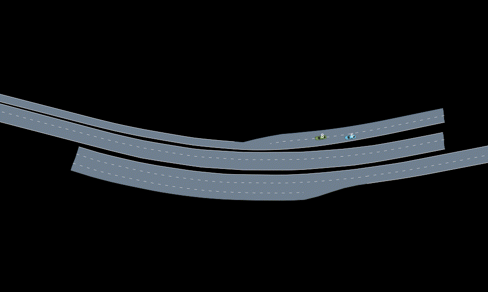

# AutomotiveInteraction.jl

Driver modeling using the [Interaction](https://interaction-dataset.com/) driving dataset

## Trajectory replay
Here is a video showing replay trajectories for the first 100 timesteps 