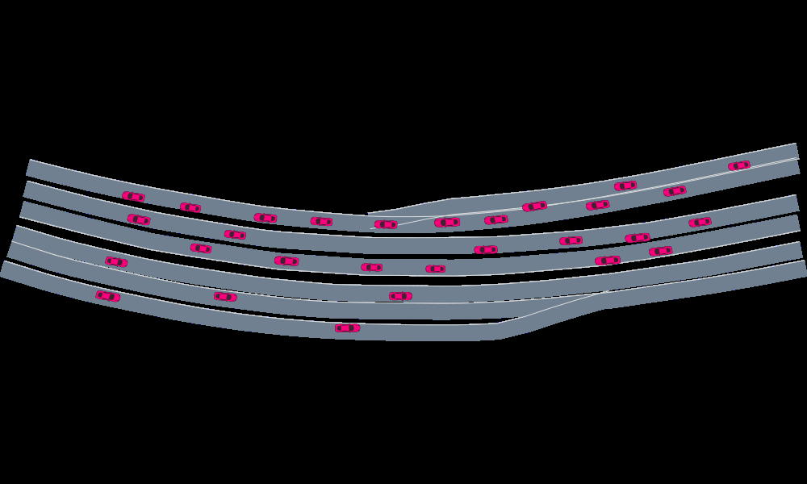

# AutomotiveInteraction.jl

Driver modeling using the Interaction dataset

## Getting started
- You will need to have `AutomotiveDrivingModels`, `AutoViz`, `Reel`, `DelimitedFiles` and `DataFrames` julia packages installed
- Run the `interaction_experiment.ipynb` notebook in the `julia_notebooks` folder. You will be able to generate a video replaying the first 100 steps of the provided data. The resulting video file will be saved to `julia_notebooks/media`

## Resulting video
Here is a video showing replay trajectories for the first 100 timesteps as generated by running the `interaction_experiment.ipynb` notebook 
